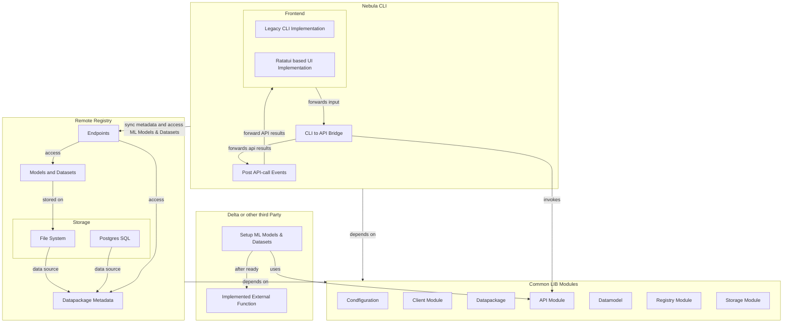

# Architecture

The architecture is divided in four crates, whereby Delta is used as example for an external crate.

- Common Lib is a library crate that implements most functionality in modules.
- Nebula CLI is the package manager as command line tool.
- Remote Registry is a server that provides endpoints to list and get package informations.
- Delta acts as example for an extrnal crate that uses Nebula as registry for modules.

The following mermaid diagram illustrates some of the relationship.

## Nebula CLI

The command line supports a legacy (interactive) commandline that is powered by [clap](https://github.com/clap-rs/clap). A bridge module is used to transform the clap-related structs into the input arguments of the API module and Model datatypes of the common library.

After the invocation of an API function the results is forwared to a trait that has different implementations for the legacy command line and a [ratatui](https://ratatui.rs/) based TUI.

## Nebula Remote Registry

